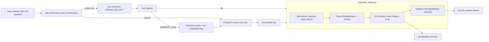

# YouTube Assistant

Ask anything about a YouTube video. The app pulls the transcript, embeds it
with OpenAI, retrieves the most relevant chunks for your question, and streams
a grounded answer back token-by-token. Built with Streamlit and LangChain.

[Live demo](https://your-app.streamlit.app) &nbsp;·&nbsp; [Portfolio](https://your-portfolio.com)


## Features

- **Server-held key with a daily safety net.** A small per-IP daily quota
  protects the demo wallet; once a visitor uses it up they can paste their own
  OpenAI key without leaving the page.
- **Graceful fallback if demo credits run out.** When the server's OpenAI
  account hits `insufficient_quota` (or the key is revoked) the app refunds the
  failed request, switches into BYOK mode, and tells the user clearly.
- **Streaming answers.** Tokens appear as they're produced via
  `st.write_stream` for that ChatGPT-style feel.
- **Cached vector index per URL.** First question on a new video pays the
  embedding cost; subsequent questions on the same URL are instant.
- **Grounded, with sources.** Every answer is followed by an expander showing
  the exact transcript chunks the LLM was given.
- **Embedded video.** The video plays alongside the answer instead of being a
  bare link.

## Architecture



| File | Role |
| --- | --- |
| [`main.py`](main.py) | Streamlit UI: hero form, key resolution, streaming, sources expander, BYOK fallback. |
| [`langchain_helper.py`](langchain_helper.py) | Transcript loading, FAISS build, retrieval + streaming chain, OpenAI error classifier. |
| [`rate_limit.py`](rate_limit.py) | SQLite-backed per-IP daily counter with `check_and_increment`, `remaining`, `refund`. |
| [`.streamlit/config.toml`](.streamlit/config.toml) | Theme. |
| [`.streamlit/secrets.toml`](.streamlit/secrets.toml) | **Local only** (gitignored). Stores `OPENAI_API_KEY` and `DAILY_REQUEST_CAP`. |

## Run locally

Requires Python 3.11.

```bash
git clone https://github.com/Bennyelekwa/youtube-assistant.git
cd youtube-assistant

python -m venv .venv
source .venv/bin/activate
pip install -r requirements.txt
```

Then create `.streamlit/secrets.toml` with your demo key:

```toml
OPENAI_API_KEY = "sk-..."
DAILY_REQUEST_CAP = 5
```

And run:

```bash
streamlit run main.py
```

## Deploy to Streamlit Cloud

1. Push the repo to GitHub.
2. Create a new app at [share.streamlit.io](https://share.streamlit.io) pointing
   at `main.py`.
3. In **Settings -> Secrets**, paste:

   ```toml
   OPENAI_API_KEY = "sk-..."
   DAILY_REQUEST_CAP = 5
   ```

4. Reboot the app.

> **Note on `usage.db`.** Streamlit Cloud uses an ephemeral filesystem, so the
> daily counter resets on every redeploy. That's fine for a portfolio demo. If
> you outgrow it, swap the SQLite store in [`rate_limit.py`](rate_limit.py) for
> Upstash Redis or a small Postgres table.

## Tech stack

- [Streamlit](https://streamlit.io/) for the UI and deployment target.
- [LangChain](https://python.langchain.com/) (`langchain`, `langchain-openai`,
  `langchain-community`, `langchain-text-splitters`).
- [FAISS](https://github.com/facebookresearch/faiss) (`faiss-cpu>=1.9.0`) for
  the in-memory vector store.
- [`youtube-transcript-api`](https://pypi.org/project/youtube-transcript-api/)
  for transcript fetching.
- OpenAI `text-embedding-ada-002` (default for `OpenAIEmbeddings`) and
  `gpt-3.5-turbo-instruct` for generation.

## Roadmap

- Clickable timestamp links inside source chunks (jump to the video moment).
- Conversational mode (`st.chat_input` + chat history).
- Whisper fallback for videos without published transcripts.
- Swap to `gpt-4o-mini` via `ChatOpenAI` for cheaper, better answers.

## License

MIT.
